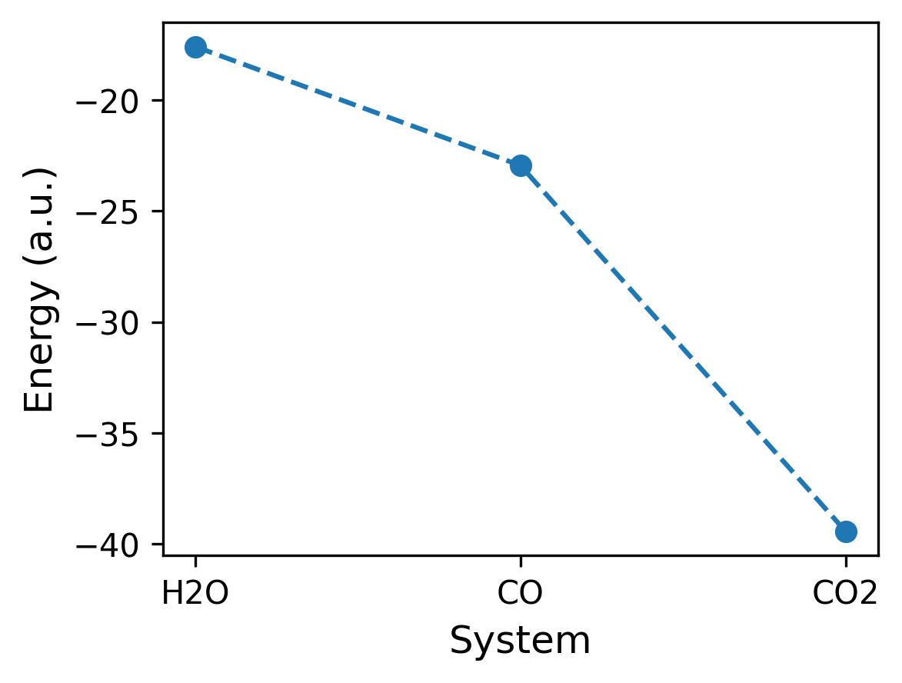

# Remote Calculation
The computer is ready and so is the target problem. This means it's time to build the Dataset and process it. The definition of `calculate` will come later.

```{.python file=min_ferm/__main__.py #remote-calculation}
from functions import calculate
from remotemanager.serialisation import serialjsonpickle
ds = Dataset(function = calculate, serialiser=serialjsonpickle())
for name, sys in systems.items():
  ds.append_run({"sys": sys, "inp": inp, "name": name})
ds.run() ; ds.wait() ; ds.fetch_results()
```

Once all the calculations have been run, we can look for the lowest energy
system by iterating over the results.

```{.python file=min_ferm/__main__.py #find-lowest}
energies = {k: v for k, v in zip(geoms, ds.results)}
mink = min(energies, key=energies.get)
minsys = systems[mink]
<<plot-lowest>>
```

While the data is available, we can generate a plot of the energies.

```{.python .build target="plot.png" file=min_ferm/__main__.py #plot-lowest}
from matplotlib import pyplot as plt
fig, axs = plt.subplots(1, 1, figsize=(4, 3))
axs.plot([energies[x] for x in geoms], 'o--')
axs.set_xticks(range(len(geoms)))
axs.set_xticklabels(geoms)
axs.set_ylabel("Energy (a.u.)", fontsize=12)
axs.set_xlabel("System", fontsize=12)
plt.savefig("docs/plot.png", dpi=300, bbox_inches = "tight")
```



With the lowest energy system determined, we now take that particular system and run the cubefile generator on the remote machine.

```{.python file=min_ferm/__main__.py #write-lowest-cubefile}
from functions import write_cubefile
write_cubefile(sys=minsys, inp=inp, name=mink)
```
